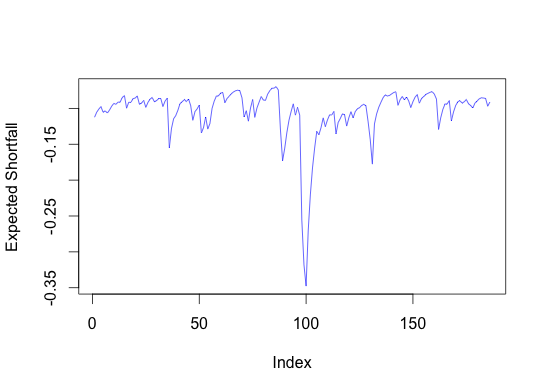

[](http://quantlet.de/)

## [](http://quantlet.de/) **TERES_EVT** [](http://quantlet.de/)

```yaml


Name of Quantlet: 'TERES_EVT'

Published in: 'not published'

Description: 'CRIX.TERES_EVT estimates the risk of the CRIX index in moving windows using an Extreme Value Approach (EVT) and the Tail Event Risk Expected Shortfall (TERES) methodology. To implement the TERES methodology, either the Laplace or a stable distribution can be chosen. If a stable distribution is implemented, the index parameter alpha needs to be estimated first for each of the moving windows. This estimation takes a lot of time. Therefore, estimation results are provided for the example data set crix.csv. Shape and Scale parameter estimated during the EVT approach are also provided in the final table of results.'

Keywords: 'expected shortfall, expectile, EVT, index, crypto, bitcoin, risk,
           risk measure, risk management'

See also: 'TERES_RollingWindow, CRIXoutmarketTERES'

Author: Simon Trimborn, Philipp Gschöpf, Verena Weber

Submitted:  

Datafile: 'crix.csv, alpha.indparam.RData'

Input: 'RiskLevel, Contamination, windowsize, distribution'

Output:  ESresults

```



### R Code
```r

# Load required packages
library("VGAM")
library("BMS")
library("expectreg")
library("fGarch")
library("numDeriv")
library("rootSolve")
library("evd")
library("MASS")
library("stabledist")

# Uncomment to change your working directory setwd()

# Set parameters
RiskLevel		  = 0.01 # Predetermined Value at Risk level
Contamination	= 0.2  # between  0 and 1, 0 = Normal, 1 = Laplace
windowsize		= 250  # Estimation window size for the rolling window
distribution  = "StableDist" # Distribution used in TERES methodology

Crix = read.csv("crix.csv")
y = Crix[, 2]
y = diff(log(y))
y = na.omit(y)

# Pre-white data with a GARCH model
GARCHvola = garchFit(~garch(1, 1), data = y)
ywhite    = y/volatility(GARCHvola)
yclean    = ywhite - mean(ywhite)

# Estimation of the index parameter alpha (stable distributions) for each of the moving windows
alpha.indparam = matrix(data = NA, nrow = (length(y) - windowsize + 1), ncol = 1)

for (i in (1:(length(y) - windowsize + 1))) {
  ywindow = yclean[(i):(i + windowsize - 1)]
  Fit     = stableFit(ywindow, alpha = 1.75, beta = 0, gamma = 1, delta = 0, 
                      type = "mle", doplot = FALSE, control = list(), 
                      trace = FALSE, title = NULL, description = NULL)
  alpha.indparam[i] = Fit@fit$estimate[1]
}

# Helpful funtions
tau = function(alpha, delta = 0, distribution) {
  if (alpha < 1e-27) {
    return(0)
  }
  switch(distribution, Laplace = {
    F = function(x) {
      (1 - delta) * pnorm(x) + delta * plaplace(x)
    }
  }, StableDist = {
    F = function(x) {
      (1 - delta) * pnorm(x) + delta * pstable(x, alpha = alpha.indparam[i], beta = 1)
    }
  })
  
  f = function(x) {
    grad(F, x)
  }
  inverse = function(f, lower = -100, upper = 100) {
    function(y) uniroot((function(x) f(x) - y), lower = lower, upper = upper)[1]
  }
  quantileFun = inverse(F)
  q = as.numeric(quantileFun(alpha))
  LPM = function(x) {
    x * (f(x))
  }
  LPMq = function(x) {
    integrate(LPM, -Inf, x)
  }
  tmp = as.numeric(LPMq(q)[1]) - q * alpha
  return(tmp/(2 * tmp + q))
}

ES = function(delta, alpha, sample) {
  funtau = sapply(alpha, tau, delta, distribution)
  etau   = quantile(sample, alpha)
  return(etau + (etau - mean(sample))/(1 - 2 * funtau) * (funtau/alpha))
}

ES.EVT = function(x, alpha) {
  L  = -x
  zq = quantile(L, 1 - alpha)
  # meplot(L, xlim = c(0,5))
  thr = quantile(L, 0.9)
  fitty = fpot(L, thr, model = "gpd", std.err = F)
  scale = as.numeric(fitty$scale)
  shape = as.numeric(fitty$param[2])
  evtES = -(zq/(1 - shape) + (scale - shape * thr)/(1 - shape))
  return(c(evtES, scale, shape))
}

# Actual estimation, this can take up to a minute
ESresults = matrix(data = NA, nrow = (length(y) - windowsize + 1), ncol = 4)
colnames(ESresults) = c("TERES", "EVT", "scale", "shape")
for (i in (1:(length(y) - windowsize + 1))) {
  ywindow = yclean[(i):(i + windowsize - 1)]
  ESresults[i, 1]   = ES(Contamination, RiskLevel, ywindow) * volatility(GARCHvola)[i + windowsize - 1]
  ESresults[i, 2]   = ES.EVT(ywindow, RiskLevel)[1] * volatility(GARCHvola)[i + windowsize - 1]
  ESresults[i, 3:4] = ES.EVT(ywindow, RiskLevel)[2:3]
}

# Plot the results
plot(ESresults[, 1], ylab = "Expected Shortfall", type = "l", lwd = 0.8, col = "blue")
plot(ESresults[, 2], ylab = "Expected Shortfall", type = "l", lwd = 0.8, col = "green")

plot(ESresults[, 1] - ESresults[, 2], ylab = "Expected Shortfall", type = "l", lwd = 2, col = "red")


# uncomment to save the results write.table(ESresults, file = 'ESfromRollingWindow.csv', sep = ',')
# write.table(yclean, file = 'StandardizedReturns.csv', sep = ',') 
```

automatically created on 2018-10-15